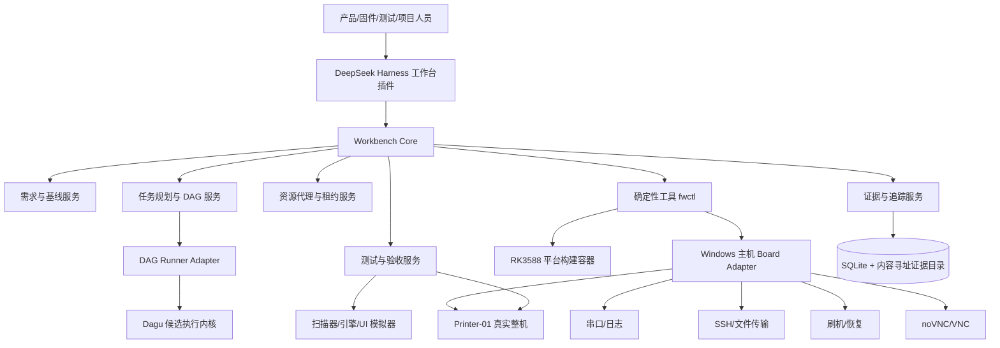
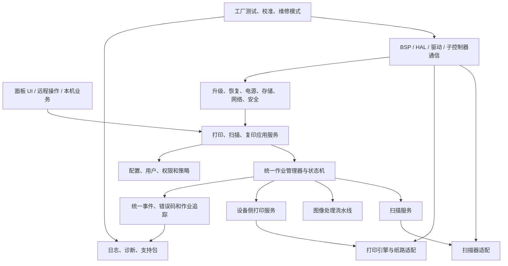
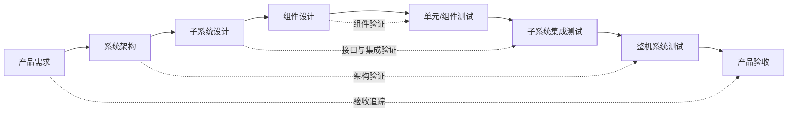
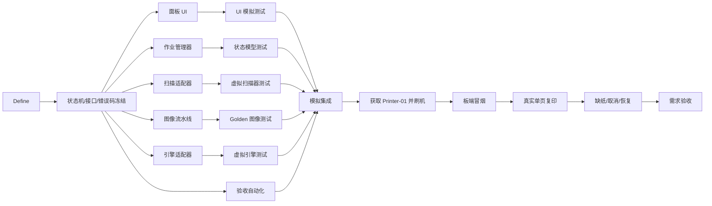
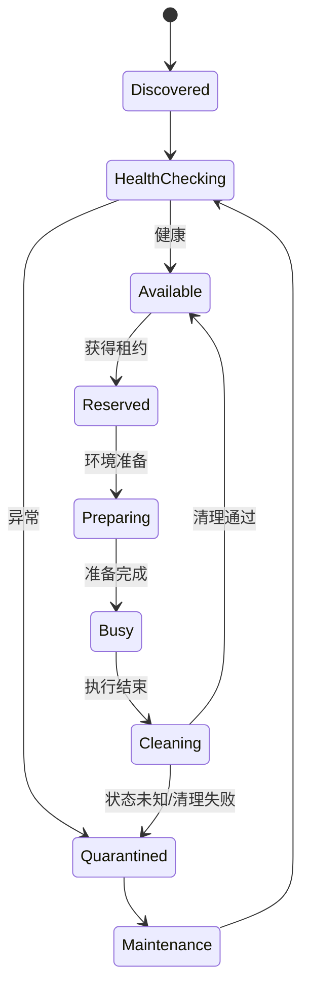

# 打印机固件智能开发工作台总体方案说明书

> 文档版本：v1.0  
> 文档状态：方案评审稿  
> 编制日期：2026-08-28  
> 适用范围：单台 RK3588 打印机固件研发 MVP，并为后续产品化和多设备实验室演进预留边界  
> 核心目标：从一个原始需求开始，完成定义、架构、设计、并行开发、分层测试、真实整机验收和证据归档，最终支撑真正的打印机固件产品研发

---

## 目录

- **方向与边界**：[文档定位](#0-文档定位) · [执行摘要](#1-执行摘要) · [背景与目标](#2-背景问题与目标) · [关键假设](#3-关键假设与待确认事项) · [设计原则](#4-设计原则) · [总体架构](#5-总体架构)
- **产品与研发体系**：[固件领域架构](#6-打印机固件产品领域架构) · [研发运行模型](#7-研发运行模型) · [任务 DAG](#8-任务规划与-dag-编排) · [资源租约](#9-测试资源与租约管理) · [平台基础设施](#10-平台基础设施) · [测试策略](#11-测试总体策略) · [领域验收](#12-打印机领域验收体系)
- **工作台与治理**：[证据审计](#13-证据追踪与审计) · [界面设计](#14-工作台界面设计) · [数据模型](#15-数据模型与版本管理) · [仓库结构](#16-建议仓库结构) · [安全治理](#17-安全权限与治理) · [开源选型](#18-开源组件选型)
- **落地与评审**：[MVP 纵向切片](#19-mvp-纵向切片) · [实施计划](#20-实施阶段与工作量建议) · [角色边界](#21-角色与协作边界) · [指标](#22-效率与质量指标) · [风险](#23-风险与缓解措施) · [演进路线](#24-演进路线) · [决策清单](#25-详细设计前的决策清单) · [最终建议](#26-最终建议)
- **附录**：[任务示例](#附录-a任务定义示例) · [测试用例示例](#附录-b测试用例定义示例) · [Define 模板](#附录-cdefine-模板) · [验收报告字段](#附录-d验收报告最小字段) · [参考项目与标准](#附录-e参考项目与标准)

---

## 0. 文档定位

本文档用于评审“打印机固件智能开发工作台”的总体方向，不代表已经批准实施，也不代表已经冻结具体产品需求。文档重点解决以下问题：

1. 如何基于 DeepSeek Harness 建设公司专属研发工作台，而不是只做一个 AI 串口助手。
2. 如何把打印机行业的产品架构、研发流程、任务编排、测试资源、整机验收和证据体系内置到工作台中。
3. 如何在当前只有一台真实设备的情况下，最大化并行开发效率，同时避免串口、VNC、刷机和整机测试互相争用。
4. 如何快速完成一个可演示 MVP，同时确保 MVP 的核心结构不会在后续产品化时全部推倒重来。

本文档形成的是总体方案和评审基线。总体方案通过后，下一阶段才进入详细设计，包括数据结构、接口协议、模块目录、任务清单和实现计划。

---

## 1. 执行摘要

### 1.1 推荐结论

推荐采用以下组合架构：

> **DeepSeek Harness 作为工作台交互与 AI 编排外壳，独立的 Workbench Core 负责打印机领域模型、任务 DAG、资源调度、测试与验收，确定性的 `fwctl` 工具负责构建、部署、控制和采证。**

研发方法采用混合模式：

- 产品级采用 V 模型和阶段门禁，保证需求、架构、设计、测试和验收可追踪。
- 功能级采用增量开发和并行工作包，避免传统瀑布式串行等待。
- 执行级采用任务 DAG，根据真实依赖决定任务是否可运行。
- 测试级采用分层验证和资源租约，优先在主机与模拟器运行，最后才占用真实整机。
- 验收级采用独立验证和不可变证据，避免“开发者自己写几个测试就宣布完成”。

### 1.2 MVP 的正式定义

MVP 不是多设备实验室，也不是完整打印机产品，而是一个真实、可重复的纵向闭环：

> 导入“面板发起单页黑白复印”需求，在工作台中完成 Define、接口冻结、任务拆解、并行开发、自测、模拟集成、单板部署、VNC 面板操作、真实扫描、真实出纸、异常恢复和验收报告。

PC 打印驱动由独立 PC 软件团队负责，不纳入本工作台开发范围；但设备侧仍需维护驱动—设备接口契约，并在整机验收时使用驱动团队交付的冻结版本进行兼容验证。

### 1.3 核心建设内容

MVP 必须包含以下六项核心能力：

1. **需求与定义系统**：把原始需求转化为原子化、可验证、带边界的需求契约。
2. **任务规划与 DAG 编排**：显式表达串行依赖、并行工作包、人工门禁和资源等待。
3. **平台基础设施**：按硬件架构维护版本化构建容器、刷机、连接、调试和测试能力。
4. **单机资源调度**：即使只有一台设备，也通过租约管理串口、VNC、刷机、整机和工装。
5. **打印机领域测试与验收**：覆盖功能、状态机、纸路、图像、性能、恢复、安全、升级、服务和制造。
6. **证据与追踪系统**：建立需求—设计—代码—测试—硬件—固件—验收结论的完整链路。

### 1.4 本阶段明确不做

- 不开发 PC 打印驱动。
- 不建设多设备机房和远程设备池。
- 不建设云端 SaaS 或 Kubernetes 集群。
- 不在 MVP 中完成完整行业认证、寿命试验和量产导入。
- 不在总体方案评审前修改固件代码或启动工作台实现。

---

## 2. 背景、问题与目标

### 2.1 当前基础

现有 `DSH Linux Monitor` 已具备 Windows 串口连接、实时日志、性能监控、Shell、自动重连、诊断 ZIP 和 DeepSeek Harness 工具调用等能力，可作为“设备现场控制与观测”的第一块基础。当前版本没有固件刷写、SSH、远程构建、VNC、任务 DAG、资源调度和多层验收。

因此，后续方向不应继续堆叠零散串口功能，而应把现有能力收纳为工作台中的“设备驾驶舱”组件。

### 2.2 当前研发效率的主要矛盾

打印机固件研发具有明显的系统工程和硬件耦合特征：

- 主控、扫描器、图像链路、打印引擎、纸路、面板 UI、网络、升级和诊断互相依赖。
- 有些模块可以用模拟器和契约并行开发，有些集成必须按物理链路串行进行。
- 真实设备、故障注入工装、纸张、碳粉、仪器和人工操作都是稀缺测试资源。
- 测试失败可能来自产品缺陷、测试脚本、硬件环境、耗材状态或设备未清理，不能混为一类。
- 单项功能完成不等于打印机产品完成；可靠性、恢复、安全、升级、维护和制造缺一不可。

传统的“需求—设计—开发—测试—验收”阶段列表只能说明顺序，无法管理真实依赖、资源争用和并行效率。

### 2.3 总体目标

工作台最终应成为打印机固件研发的统一入口：

- 统一导入和澄清需求。
- 统一管理产品、硬件、BSP 和固件基线。
- 统一规划任务和计算关键路径。
- 统一调度构建、模拟器、单板、整机、工装和人工资源。
- 统一执行构建、刷机、调试、测试和验收。
- 统一沉淀打印机领域架构、用例和验收标准。
- 统一记录 AI、开发者、测试者和产品负责人的决策。
- 统一生成可审计的证据包和验收报告。

### 2.4 成功判据

工作台是否成功，不以“AI 能写多少代码”衡量，而以以下结果衡量：

- 从需求导入到可验收候选版本的端到端周期缩短。
- 真实设备等待时间和无效占用下降。
- 模拟器和主机测试承担更多前置验证，减少整机试错。
- 因接口不清导致的返工减少。
- 因测试环境问题导致的误报和重复测试减少。
- 每个验收结论都能追踪到准确的需求、代码、固件、硬件和证据。
- 新产品和新硬件平台能够复用已有流程、领域包和验收目录。

---

## 3. 关键假设与待确认事项

### 3.1 当前建议采用的工作假设

| 编号 | 工作假设 | 当前状态 | 若不成立的影响 |
|---|---|---|---|
| A1 | 主控为 RK3588，运行嵌入式 Linux/BusyBox，系统主要存储为 eMMC | 待确认 | 平台包、容器和升级方案需要调整 |
| A2 | MVP 产品基线为 A4 黑白多功能一体机 | 建议值 | 验收目录和首个切片需按实际型号调整 |
| A3 | MVP 有一台可连接扫描器和打印引擎的真实样机 | 待确认 | 只能完成工作台演示，不能完成整机验收 |
| A4 | PC 驱动由独立团队交付 | 已确认 | 工作台只维护设备侧契约和集成验收 |
| A5 | 面板 UI 可通过网络暴露 VNC 或可适配的画面/输入接口 | 待验证 | 需要开发 Qt/EGLFS 或其他专用显示适配器 |
| A6 | 当前 BSP 和工具链可以在 Windows 上通过 Docker/WSL 构建 | 待验证 | 需选择 Linux 构建主机或重新定义环境边界 |
| A7 | 扫描器和打印引擎至少具有可调用的设备侧接口 | 待确认 | 模拟器、契约和纵向切片无法冻结 |
| A8 | 首个演示需求采用“面板发起单页黑白复印” | 建议值 | DAG、用例和演示脚本需替换 |

### 3.2 总体方案评审需要形成的决策

1. 是否认可“DeepSeek Harness 外壳 + 独立 Workbench Core”的总体边界。
2. 是否认可产品级 V 模型、功能级增量、执行级 DAG 的混合研发方法。
3. 是否从 MVP 起就建设单机资源租约，而不是等到多设备再补。
4. 是否采用 A4 黑白 MFP 和本机单页复印作为首个产品基线与纵向切片。
5. 是否同意先验证 Dagu 作为 DAG Runner，并保持可替换接口。
6. 是否同意真实硬件操作留在主机适配器，构建和主机测试进入平台容器。

---

## 4. 设计原则

### 4.1 领域优先，而不是工具优先

工作台核心资产应是打印机产品基线、领域架构、接口契约、状态机、验收目录和证据模型。DeepSeek Harness、DAG Runner、VNC 和测试框架都应处于可替换边界。

### 4.2 AI 负责推理，工具负责确定性执行

AI 可以：

- 澄清需求和发现矛盾。
- 生成架构选项和任务拆解。
- 判断影响范围和推荐测试。
- 分析日志、时间线和失败证据。
- 生成修改计划和验收报告草稿。

确定性工具必须负责：

- 构建、刷机、部署、重启和恢复。
- 资源获取、锁定和释放。
- 测试执行、超时、重试和清理。
- 产物哈希、环境快照和证据归档。
- 门禁状态和最终验收数据。

### 4.3 契约先行、增量冻结

不要求所有架构设计完成后才允许开发。某个工作包依赖的接口、状态机和错误语义一旦冻结，该工作包即可启动；尚未冻结的其他领域不阻塞它。

### 4.4 尽量晚占用真实硬件

测试顺序必须优先使用静态分析、单元测试、模型测试、模拟器和离线样本。只有上层验证通过，任务才进入真实板卡和整机队列。

### 4.5 每项开发都有自测，每项完成都有独立验证

开发任务必须产生自测；但需求验收由独立验证任务根据原始需求和验收契约执行，不能只接受开发者提供的测试结果。

### 4.6 单机优先，但资源模型不能缺失

MVP 只支持一台真实设备，不建设分布式调度；但设备、串口、VNC、工装和人工操作必须从第一天按资源建模，否则后续会产生不可控争用和返工。

### 4.7 证据优于结论

任何“通过”都必须绑定具体固件哈希、源码提交、平台版本、硬件版本、环境、日志、截图、测量结果和执行者。没有证据的 PASS 无效。

---

## 5. 总体架构

### 5.1 逻辑架构



### 5.2 核心组件职责

| 组件 | 核心职责 | MVP要求 |
|---|---|---|
| DSH 工作台插件 | 统一交互、AI 协作、审批、界面和实时状态 | 必须 |
| Workbench Core | 打印机领域、流程、任务、资源、测试、验收的核心 API | 必须，独立于 DSH |
| Requirement Service | 需求导入、Define、基线、变更和追踪 | 必须 |
| Planner | 任务拆解、依赖图、关键路径、测试影响分析 | 必须 |
| DAG Runner Adapter | 把任务图交给可持久化执行内核 | 必须，可替换 |
| Resource Broker | 设备、通道、工装、耗材和人工资源租约 | 必须，先本地单机 |
| Platform Pack | 某硬件架构的构建、刷机、调试和测试能力 | 必须，先 RK3588 |
| Printer Domain Pack | 产品基线、领域架构、模板、用例和验收目录 | 必须，先 A4 黑白 MFP |
| Test/Acceptance Service | 用例选择、分层执行、结果分类和验收门禁 | 必须 |
| Evidence Store | 产物、日志、截图、报告、决策和哈希 | 必须 |
| Device Cockpit | VNC、串口、指标、作业时间线和调试入口 | 必须 |

### 5.3 部署拓扑

MVP 推荐采用单机本地部署：

```text
Windows 开发工作站
├─ DeepSeek Harness + 专属工作台插件
├─ Workbench Core + SQLite
├─ DAG Runner（Dagu 候选）
├─ 现有串口监控能力
├─ Board Adapter
│  ├─ COM 串口
│  ├─ 厂商刷机工具
│  ├─ SSH/SFTP
│  ├─ noVNC/websockify
│  └─ 工装控制
└─ Docker Desktop/WSL
   ├─ printer-fw-rk3588:<bsp-version>
   ├─ 主机单元与组件测试
   └─ 扫描器/引擎模拟器

Printer-01
├─ RK3588 主控
├─ 面板显示与输入
├─ 扫描器
├─ 打印引擎和纸路
└─ 网络、串口及调试接口
```

硬件连接保留在 Windows 主机，避免把 USB、串口和厂商刷机工具强行塞入容器。构建、静态检查、离线测试和可重复工具链进入容器。

### 5.4 核心命令面

工作台通过稳定的 `fwctl` 命令面控制确定性动作：

```text
fwctl requirement import
fwctl define validate
fwctl infra check
fwctl plan validate
fwctl build
fwctl package
fwctl device acquire
fwctl device health
fwctl deploy
fwctl test select
fwctl test run
fwctl accept evaluate
fwctl evidence export
fwctl device release
```

`fwctl` 是工作台最重要的可迁移边界。即使未来替换 DeepSeek Harness 或 DAG Runner，上述能力仍可被 CI、工程师或其他 AI 工具调用。

---

## 6. 打印机固件产品领域架构

### 6.1 产品不是三个功能按钮

真正的打印机固件产品不能只覆盖打印、扫描和复印三个主流程，还必须覆盖：

- 启动、待机、休眠、唤醒、关机和异常重启。
- 设备配置、区域、时间、语言、网络和用户权限。
- 作业接收、排队、执行、暂停、取消、失败、恢复和历史。
- 扫描器、图像处理、打印引擎、纸路、耗材和传感器。
- 面板 UI、按键、触摸、提示、错误引导和服务模式。
- 固件升级、回滚、恢复、出厂重置和数据迁移。
- 日志、错误码、诊断包、远程支持和现场维修。
- 序列号、硬件版本、校准、工厂测试和量产配置。
- 性能、可靠性、安全、能耗和合规支持。

### 6.2 推荐领域分层



### 6.3 建议领域模块

| 领域 | 主要职责 | 必须具备的产品能力 |
|---|---|---|
| Board/BSP | 启动、设备树、驱动、时钟、电源、存储、网络 | 稳定启动、恢复入口、硬件版本识别 |
| Device State | 整机状态、可用性、传感器汇总 | 唯一状态源、事件订阅、持久状态 |
| Job Manager | 作业 ID、队列、状态机、取消、恢复 | 状态一致、幂等、掉电恢复策略 |
| Print Service | 作业接收、参数、数据、提交引擎 | 与 PC 驱动团队的设备侧契约 |
| Scan Service | 平板/ADF、参数、图像采集、错误 | 分辨率、尺寸、校正、超时和恢复 |
| Image Pipeline | 旋转、缩放、灰度、半色调、压缩等 | 可离线测试、可测性能、可追踪参数 |
| Copy Service | 扫描—图像—引擎编排 | 本机闭环、份数、纸张和异常恢复 |
| Engine Adapter | 引擎通信、纸路、传感器、耗材 | 状态、错误码、卡纸和恢复语义 |
| Panel UI | 用户流程、状态、错误引导、服务入口 | 与设备状态一致、可自动操作和采证 |
| Config/IAM | 配置、账号、角色、权限和策略 | 模式隔离、版本迁移、安全默认值 |
| Update/Recovery | 包验证、安装、回滚、恢复 | 断电安全、兼容校验、可诊断 |
| Diagnostics | 结构化日志、事件、指标、飞行记录 | 一键支持包和统一作业追踪 |
| Factory/Service | 校准、序列号、产测、维修 | 受控权限、结果留痕、硬件绑定 |

### 6.4 驱动—设备边界

PC 驱动不由本工作台开发，但以下设备侧契约仍属于固件产品：

- 传输协议和连接方式。
- 作业数据格式或 PDL/raster 约定。
- 纸张、纸盒、单双面、份数、方向、色彩等能力模型。
- 打印机状态、作业状态、错误、取消和超时。
- 设备能力查询、版本协商和兼容策略。
- 驱动版本、固件版本和产品型号兼容矩阵。

接口冻结前，设备团队和 PC 团队应共同维护一份可机读契约；整机验收使用驱动团队提供的冻结产物，不在工作台内编译或修改驱动。

### 6.5 跨领域统一约束

所有核心模块必须遵守：

- 一个作业从 UI/驱动入口到扫描器、图像、引擎和日志都携带同一 `job_id`。
- 状态改变必须通过统一事件定义，不允许各模块自行解释同一错误。
- 错误码至少包含领域、严重度、可恢复性、用户动作和维修动作。
- 持久数据必须带 schema 版本和迁移策略。
- 外部接口必须声明超时、幂等、重试和取消语义。
- 关键路径必须声明 CPU、内存、存储、带宽和时延预算。

---

## 7. 研发运行模型

### 7.1 混合模型

本方案不采用纯瀑布，也不采用“所有事情都放进 Sprint”的纯敏捷模型，而是：

```text
产品级：V 模型 + 基线 + 阶段门禁
功能级：短周期增量 + 并行工作包
执行级：任务 DAG + 依赖和资源调度
验证级：分层测试 + 独立验收
```

产品级 V 模型保证左侧设计产物与右侧验证产物一一对应：



### 7.2 阶段与门禁

| 阶段 | 核心活动 | 关键输出 | 出口门禁 |
|---|---|---|---|
| P0 需求接收 | 导入、来源、初筛、去重、业务价值 | 原始需求、范围和负责人 | G0 接受/拒绝/等待 |
| P1 Define | 场景、硬件、功能、非功能、异常、验收 | Definition Baseline | G1 定义完成 |
| P2 可行性与基础设施 | 技术验证、平台能力检查、缺口建设 | Spike 结果、平台能力清单 | G2 平台就绪 |
| P3 架构与契约 | 领域影响、状态机、接口、资源预算 | 架构决策、接口和测试契约 | G3 契约基线 |
| P4 并行开发 | 工作包设计、实现、自测、独立验证 | 可集成组件 | G4 集成候选 |
| P5 分层集成 | 模拟、板端、子系统、整机逐级集成 | 集成证据 | G5 整机候选 |
| P6 产品验收 | 功能、性能、恢复、安全、维护等 | 验收报告、偏差清单 | G6 产品通过/拒绝 |
| P7 发布基线 | 版本、升级包、说明、回滚和归档 | Release Baseline | G7 发布批准 |

### 7.3 阶段门禁不是全局暂停

阶段用于治理，不用于强迫所有任务同步。例如：

- 扫描器接口一旦冻结，扫描适配器和扫描测试可以启动。
- 图像数据格式一旦冻结，图像流水线可以离线开发。
- 面板 UI 可以连接 Mock Job API，不必等待真实打印引擎。
- 验收自动化可以在功能实现之前，根据验收契约先行开发。
- 未冻结的纸路恢复策略只阻塞相关任务，不阻塞日志、升级或 UI 基础能力。

### 7.4 Time-boxed Spike

对 UI 显示栈、VNC、扫描器接口、引擎接口、BSP 容器化等不确定问题，允许在正式架构冻结前创建限时 Spike。Spike 必须有明确问题、时间上限、退出标准和结论，不允许以“探索”为名长期演化为未评审的生产代码。

---

## 8. 任务规划与 DAG 编排

### 8.1 任务不是普通待办事项

工作台中的任务是可调度、可验证、可追踪的工程单元。每个任务至少包含：

- 类型、目标、负责人或执行角色。
- 前置任务和依赖的基线版本。
- 输入产物和输出产物。
- 进入条件和完成条件。
- 所需资源、锁模式和预计占用。
- 执行动作、验证动作和证据要求。
- 超时、重试、失败分类、清理和恢复策略。

### 8.2 任务类型

| 类型 | 说明 | 典型输出 |
|---|---|---|
| Decision | 需要产品、架构或安全决策 | 决策记录、批准/拒绝 |
| Define | 澄清需求和验收 | 原子需求、验收契约 |
| Spike | 限时验证不确定性 | 结论、数据、建议 |
| Contract | 冻结接口、状态机、数据和错误 | 版本化契约 |
| Design | 形成架构或详细设计 | ADR、时序、状态图 |
| Implementation | 实现受控变更 | 代码、配置、构建产物 |
| Self-Test | 开发工作包自测 | 单元/组件结果 |
| Independent Verification | 独立验证任务 | 通过/失败和证据 |
| Integration | 多组件或真实硬件集成 | 集成候选和报告 |
| Acceptance | 需求、产品或发布验收 | 验收决定 |
| Human Task | 装纸、放原稿、目视确认、批准 | 人工记录和签署 |
| Maintenance | 校准、恢复、设备清理 | 资源恢复为健康状态 |

### 8.3 依赖类型

任务 DAG 至少支持：

- `hard_after`：前置任务成功后才能启动。
- `artifact_requires`：必须拿到特定版本的输入产物。
- `contract_requires`：必须依赖已经冻结的接口版本。
- `gate_requires`：必须获得人工或自动门禁批准。
- `resource_requires`：运行时必须取得资源租约。
- `data_requires`：必须具备测试样本、Golden 数据或硬件配置。
- `soft_after`：推荐顺序，但不阻塞执行。

### 8.4 任务可运行判定

```text
Runnable(task) =
  所有 hard_after 已成功
  AND 所有必需产物存在且版本匹配
  AND 所有接口契约已冻结
  AND 所有门禁已批准
  AND 所有资源能够原子获得
  AND 任务未被取消或隔离
```

### 8.5 任务状态

```text
DRAFT
PLANNED
BLOCKED_DEPENDENCY
BLOCKED_GATE
BLOCKED_RESOURCE
READY
RESERVED
RUNNING
VERIFYING
SUCCEEDED
FAILED_PRODUCT
FAILED_TEST
FAILED_INFRA
INVALID
CANCELLED
QUARANTINED
```

必须把依赖阻塞、资源阻塞、基础设施失败和产品失败分开，否则项目数据会失真。

### 8.6 调度优先级

默认优先级建议按以下顺序综合计算：

1. 发布阻塞和安全/严重缺陷。
2. 位于当前关键路径的任务。
3. 能够解锁更多下游并行任务的契约与集成任务。
4. 已经等待较久的任务，使用 aging 避免长期饥饿。
5. 能与当前固件、设备配置和工装状态批量执行的测试。
6. 普通功能和低风险优化。

真实硬件测试开始后默认不抢占。高优先级任务进入队列顶部，但等待当前测试完成和清理。

### 8.7 本机复印示例 DAG



### 8.8 任务清单必须自动产生测试清单

每个 Implementation 任务至少自动关联：

- 一个 Self-Test 任务。
- 一个独立 Verification 任务。
- 相关回归测试选择规则。
- 对应的证据要求。

接口或状态机发生变化时，工作台应沿追踪图找到所有消费者，并自动建议需要重新执行的组件、集成和整机测试。

### 8.9 四层计划视图

工作台应同时维护四个不同粒度的计划，避免把产品路线图和一次测试运行混在同一层：

- **产品计划**：产品基线、版本目标、关键能力和发布门禁。
- **需求计划**：一个需求的架构影响、工作包、关键路径和验收范围。
- **工作包计划**：组件设计、实现、自测、独立验证和集成依赖。
- **运行计划**：某次构建或测试使用的精确任务、资源、顺序和证据。

上层计划变更会触发下层重新计算，但已经发生的运行记录不会被改写。

### 8.10 代码集成与候选版本

- 每个工作包以独立变更集推进，必须通过自己的 L0/L1 验证后才有资格进入集成候选。
- 接口提供者和消费者可以并行开发，但共同依赖冻结的契约版本和模拟器。
- 集成候选必须是一个确定的 Git commit/merge commit，不使用开发者本地未记录状态进行整机验收。
- 建议使用合并队列：先在候选组合上完成受影响回归，再写入主基线，避免多个各自通过的分支合并后互相破坏。
- 硬件测试结果只对执行时的精确候选有效；候选变化后按影响分析重新选择测试。
- 紧急修复仍需建立任务、测试和证据，不能绕过追踪链。

### 8.11 动态重规划

以下事件触发 DAG 重新计算：需求或接口变更、任务失败、资源隔离、优先级改变、硬件版本变化、关键人员/人工任务不可用。重规划只能调整尚未开始的任务和后续依赖；运行中的真实硬件任务默认完成或安全终止后再切换，已签署证据不可回写。

---

## 9. 测试资源与租约管理

### 9.1 为什么单台设备也需要资源调度

一台设备同时可能被以下活动使用：

- 开发者通过 VNC 操作面板。
- AI 通过串口执行诊断命令。
- 自动化正在刷写固件。
- 测试脚本正在执行复印用例。
- 工程师正在调试扫描器或引擎。
- 长时间测试正在占用纸路和耗材。

没有资源租约时，这些活动会互相干扰，产生假失败、脏状态和不可复现问题。

### 9.2 资源目录

| 资源标识示例 | 类型 | 锁模式 | 说明 |
|---|---|---|---|
| `build/rk3588` | 构建容器 | 容量型 | 允许配置并发数量 |
| `sim/scanner` | 模拟器 | 容量型 | 多实例并行 |
| `sim/engine` | 模拟器 | 容量型 | 多实例并行 |
| `device/printer-01` | 真实整机 | 独占 | 刷机、整机测试时锁定 |
| `device/printer-01/serial` | 串口 | 共享读/独占写 | 日志可分发，命令必须仲裁 |
| `device/printer-01/vnc-view` | 显示 | 共享读 | 多人查看 |
| `device/printer-01/vnc-input` | 输入 | 独占 | 仅一个操作者或测试控制 |
| `device/printer-01/scanner` | 子系统 | 独占 | 真实采集期间锁定 |
| `device/printer-01/engine` | 子系统 | 独占 | 引擎与纸路测试期间锁定 |
| `fixture/power-relay-01` | 工装 | 独占 | 掉电和重启注入 |
| `instrument/image-meter` | 仪器 | 独占/预约 | 图像和物理质量测试 |
| `consumable/a4-paper` | 耗材 | 库存 | 检查数量和类型 |
| `human/operator` | 人工 | 人工任务 | 放原稿、装纸、目视确认 |

### 9.3 资源状态机



### 9.4 租约规则

- 交互调试和自动测试都必须领取租约。
- 租约包含拥有者、用途、资源、开始时间、TTL、心跳和预计结束时间。
- 查看 VNC 可以共享，远程输入必须独占。
- 串口原始日志由一个控制器读取后分发，禁止多个进程直接抢 COM 口。
- 需要多个资源的任务必须原子获取全部资源，防止死锁。
- 租约超时不能简单释放；必须先判断任务是否仍运行，并执行清理。
- 设备状态不明、刷机失败、测试进程失联时自动隔离。
- 长时间可靠性测试支持计划预约，不与临时调试混用。

### 9.5 资源匹配与调度

调度器按任务的资源 recipe 进行匹配：

```yaml
resources:
  - id: build/rk3588
    mode: capacity
    units: 1
  - id: device/printer-01
    mode: exclusive
  - id: device/printer-01/vnc-input
    mode: exclusive
  - id: device/printer-01/serial
    mode: shared-read
  - id: fixture/power-relay-01
    mode: exclusive
  - id: human/operator
    action: load-a4-original
```

只有所有资源均可获得时，调度器才会预留并执行任务。

### 9.6 提升单机效率的策略

1. L0/L1 测试不进入整机队列。
2. 同一固件哈希、设备配置和测试夹具的用例尽量批量执行，减少重复刷机。
3. 普通回归先执行，破坏性故障注入最后执行。
4. 每个硬件会话开始时做健康检查，结束时恢复到已知状态。
5. 自动化等待整机时，继续调度不需要真实硬件的工作包。
6. 交互调试使用带到期时间的租约，避免设备长期“被占用但无人使用”。
7. 统计资源等待、刷机次数和无效测试，持续调整调度规则。

### 9.7 后续多设备演进

MVP 的 Resource Broker 使用本地 SQLite 和单机适配器即可。未来出现多台设备、远程机架和 CI 共享需求时，可把设备资源层迁移到 labgrid coordinator；上层任务和验收模型保持不变。

---

## 10. 平台基础设施

### 10.1 一个硬件架构一个 Platform Pack

每种硬件架构维护一个版本化平台包，例如：

```text
platform: rk3588
bsp: 1.4.2
container: printer-fw-rk3588:bsp-1.4.2
flash-provider: rockchip-vendor
board-profile: printer-rk3588-rev-a
```

Platform Pack 包含：

- 硬件和 BSP 元数据。
- 工具链、构建命令和产物规则。
- Dockerfile/镜像版本和依赖锁定。
- 刷机、恢复、串口、SSH、VNC 和调试适配器。
- 健康检查和已知状态恢复脚本。
- 板端基础测试和诊断命令。
- 平台能力、限制、已知问题和兼容矩阵。

### 10.2 容器边界

容器中放置：

- 交叉编译工具链。
- BSP 构建依赖。
- 编译、静态分析、单元测试和打包工具。
- 镜像制作、签名、SBOM 和哈希工具。
- 主机侧协议测试客户端。
- 模拟器和 Golden 数据处理工具。

容器外保留：

- Windows COM 串口。
- 厂商 USB 刷机工具。
- 本地 VNC/SSH 隧道。
- 真实设备和工装控制。
- 用户审批和桌面凭据。

源代码采用挂载方式进入容器，构建缓存使用独立命名卷，构建产物必须记录容器镜像摘要。

### 10.3 构建可重复性

每个产物至少记录：

- Git commit 和脏工作区状态。
- 产品基线、平台、BSP、硬件版本。
- 容器镜像 digest。
- 工具链版本和主要依赖锁。
- 构建参数、Feature flags 和签名配置。
- 输出文件 SHA-256。
- 构建日志和测试结果。

### 10.4 板端连接与调试

现有串口工作台继续承担：

- 串口枚举、连接、重连和唯一设备识别。
- 实时日志、搜索、筛选、书签和导出。
- CPU、内存、存储、网络和 I/O 指标。
- Shell、进程、网络和诊断快照。

MVP 需要新增：

- SSH/SFTP 作为可靠命令和文件通道。
- 固件刷写、启动等待和恢复适配器。
- VNC/noVNC 面板显示和输入。
- 统一时间同步和跨通道事件时间线。
- 资源租约和独占写控制。
- 测试执行和证据绑定。

### 10.5 VNC 方案

前端统一使用 noVNC。板端方案按实际 UI 栈决定：

- X11：优先 x11vnc，镜像真实物理显示。
- wlroots Wayland：评估 wayvnc。
- Qt Quick/EGLFS：验证 vnc-eglfs 或实现应用级画面捕获与输入注入适配器。
- Weston 或其他合成器：根据其远程输出能力增加专用 provider。

Phase 0 必须验证：

1. 是否显示真实面板内容，而不是独立虚拟桌面。
2. 是否正确注入触摸、按键和坐标。
3. 是否能区分查看模式和交互模式。
4. 是否能把截图、输入事件和串口日志对齐到同一时间线。
5. 是否能仅绑定本机/研发网络，并通过 SSH 或安全代理保护。

### 10.6 模拟器策略

MVP 不追求完整 RK3588 仿真，而是建设接口级模拟器：

- 虚拟扫描器：输入录制图像、延迟、超时、断开、卡纸和错误码。
- 虚拟打印引擎：模拟预热、缺纸、开盖、卡纸、碳粉低、出纸和恢复。
- 作业状态模型：遍历正常、取消、失败、重试和恢复路径。
- UI Mock API：让面板不依赖真实设备即可开发和回归。
- 图像离线运行器：对固定输入产生可比较输出和性能数据。

模拟器必须与真实适配器共享契约测试，避免模拟器与真实设备行为长期漂移。

### 10.7 升级与恢复预留

产品化阶段必须建立安全升级、兼容检查、断电恢复和回滚。对于 BusyBox/eMMC、需要同时更新 rootfs、内核、引导和可能的子控制器固件的设备，SWUpdate 是优先评估候选；若产品采用严格 A/B 系统，也可评估 RAUC。MVP 只完成升级架构和测试接口定义，不建设 OTA 后台。

---

## 11. 测试总体策略

### 11.1 分层测试模型

| 层级 | 环境 | 主要目标 | 是否占用真实整机 |
|---|---|---|---|
| L0 | 主机/容器 | 静态检查、单元、纯算法和模型测试 | 否 |
| L1 | 模拟器/虚拟组件 | 接口契约、状态机、异常路径和离线图像 | 否 |
| L2 | RK3588 主板 | BSP、进程、资源、网络、存储和板端服务 | 可能只占主板 |
| L3 | 真实子系统 | 扫描器、引擎、纸路、面板分别集成 | 是，按子系统锁 |
| L4 | 真实整机 | 端到端功能、恢复、性能和体验 | 是，整机独占 |
| L5 | 实验室/长期 | 质量、寿命、环境、安全、能耗和合规 | 是，仪器和长期预约 |

MVP 对首个纵向切片完成选定的 L0-L4；L5 建立目录、接口和后续计划，不宣称已经完成认证。

### 11.2 测试左移规则

- L0 未通过，不允许进入 L1。
- 组件契约未通过，不允许进入模拟集成。
- 模拟集成未通过，不允许刷写整机候选。
- 板端健康和冒烟未通过，不允许执行昂贵的整机用例。
- 主流程未通过，不执行长时间、破坏性或耗材消耗大的测试。

### 11.3 测试任务生命周期

```text
选择测试
→ 检查固件、产品、平台和硬件版本
→ 计算资源 recipe
→ 获取租约
→ 健康检查
→ 准备环境/装纸/放原稿
→ 执行步骤
→ 自动断言与人工确认
→ 采集证据
→ 清理和恢复
→ 分类结果
→ 释放或隔离资源
```

### 11.4 结果分类

| 结果 | 含义 | 处理原则 |
|---|---|---|
| PASS | 产品行为满足验收标准 | 记录证据 |
| PRODUCT_FAIL | 确认为产品缺陷 | 创建缺陷并阻塞相应门禁 |
| TEST_FAIL | 用例、脚本或断言有问题 | 修复测试，不能记产品失败 |
| INFRA_FAIL | 构建、连接、刷机、工装或环境失败 | 进入基础设施处理 |
| BLOCKED_RESOURCE | 所需设备、工装、耗材或人工不可用 | 保持排队，不算失败 |
| INVALID | 前置状态错误、样本错误或执行无效 | 清理后重新运行 |
| FLAKY | 相同条件下结果不稳定 | 隔离用例并追踪根因 |
| WAIVED | 已知偏差并获得正式批准 | 必须记录范围、风险和期限 |

产品断言失败不应自动重试到通过。只有明确识别为连接抖动、基础设施超时等类别时才允许有限重试。

### 11.5 每个工作包的测试要求

每个工作包必须提供：

- 正常路径测试。
- 边界条件测试。
- 至少一个错误和恢复测试。
- 资源预算或性能断言。
- 日志和可观测性断言。
- 对接口契约的兼容性测试。
- 独立验证任务。

### 11.6 Golden 数据与测试 Oracle

- 图像处理使用版本化 Golden Input/Output，并允许配置容差和度量方法。
- 状态机使用模型或显式转移表作为 Oracle。
- 协议和接口使用契约测试作为 Oracle。
- 面板 UI 使用可访问节点、截图、事件和设备状态组合断言。
- 真实纸张质量不能只依赖肉眼；产品化阶段使用标准样张、扫描/测量设备和受控环境。

---

## 12. 打印机领域验收体系

### 12.1 验收层级

1. **任务完成验收**：单项设计、实现、自测和代码审查是否完成。
2. **组件验收**：模块是否满足接口、性能、错误和可观测性契约。
3. **子系统验收**：扫描—图像、图像—引擎、UI—作业管理等联合行为是否正确。
4. **需求验收**：原始需求的全部正常、边界、异常和非功能标准是否满足。
5. **产品验收**：整机在质量、性能、可靠性、安全、升级、维护等方面是否达到产品基线。
6. **发布验收**：版本、升级包、兼容、回滚、文档、已知问题和证据是否完整。

### 12.2 需求追踪链

```text
原始需求
→ 原子需求
→ 验收标准
→ 架构决策
→ 接口/状态机
→ 工作包
→ 代码与配置变更
→ 测试用例
→ 测试运行
→ 证据
→ 验收决定
```

任何一环发生变更，工作台都应标记下游需要重新评估或回归的节点。

### 12.3 打印机产品验收目录

| 验收域 | 典型验收内容 |
|---|---|
| 生命周期 | 冷启动、热启动、待机、休眠、唤醒、关机、异常重启 |
| 作业管理 | 接收、排队、执行、暂停、取消、失败、恢复、历史和并发策略 |
| 打印设备侧 | 数据接收、能力参数、纸张、纸盒、单双面、份数、状态和错误 |
| 扫描 | 平板/ADF、分辨率、尺寸、色彩、裁切、校正、超时和卡纸 |
| 复印 | 扫描—图像—引擎闭环、份数、缩放、纸张和恢复 |
| 图像 | 文字、线条、灰阶、背景、缩放、套准、压缩和性能 |
| 打印引擎/纸路 | 预热、进纸、出纸、缺纸、开盖、卡纸、耗材和传感器 |
| 面板 UI | 可发现性、响应、状态一致、错误引导、触摸和多语言 |
| 配置与数据 | 默认值、持久化、迁移、恢复、出厂重置和区域设置 |
| 性能与资源 | 首张时间、连续速度、吞吐、CPU、内存、存储和热稳定 |
| 可靠性 | 长时间作业、重复启停、内存泄漏、资源耗尽和故障恢复 |
| 安全 | 身份认证、角色权限、网络服务、更新验证、数据保护和审计 |
| 升级恢复 | 正常升级、中断、回滚、兼容、迁移、恢复镜像和降级策略 |
| 可维护性 | 错误码、日志、统一作业 ID、诊断包、复现和维修模式 |
| 制造服务 | 序列号、硬件版本、校准、产测、维修、耗材和更换件 |
| 能耗合规 | 待机、休眠、唤醒、能源状态及市场准入测试支持 |

### 12.4 行业标准映射原则

工作台维护“标准启发的内部验收目录”，但不能因为执行了若干内部用例就宣称完成标准认证。

- ISO/IEC 24734:2021：数字打印生产率测量参考。
- ISO/IEC 24735:2021：数字复印生产率测量参考，适用条件包含 ADF 和整理能力等要求。
- ISO/IEC 17991:2021：扫描生产率测量参考，适用条件包含 ADF 等要求。
- ISO/IEC 24790:2017：黑白文字和图形硬拷贝图像质量属性。
- ISO/IEC 22592-2:2024：彩色双面打印套准和缩放精度。
- ISO/IEC 22592-3:2025：彩色打印物理耐久性。
- Hardcopy Devices cPP 1.1：硬拷贝设备安全需求的重要输入。
- ENERGY STAR Imaging Equipment 3.2：成像设备能耗要求参考。
- PWG IPP Everywhere：设备侧网络打印能力和自认证工具参考。
- IEC 62368-1：办公和 ICT 设备产品安全要求输入。

正式认证前必须购买或取得完整标准文本、确认目标市场和适用范围，并由合规负责人制定正式测试计划。

### 12.5 验收决定规则

需求或产品验收只有在以下条件全部满足时才可 PASS：

- 使用批准的产品、平台、BSP、硬件和固件基线。
- 所有必需用例均执行且通过。
- 没有把 BLOCKED、INVALID 或未执行当成通过。
- 关键缺陷已经关闭，或有正式、有期限的偏差批准。
- 证据完整并通过哈希校验。
- 人工检查项有明确执行人和签署时间。
- 独立验证任务未复用开发任务的结论作为唯一依据。

---

## 13. 证据、追踪与审计

### 13.1 Evidence Bundle

每次构建、测试、集成和验收运行都生成独立证据目录：

```text
evidence/<run-id>/
├─ manifest.json
├─ requirement-baseline.yaml
├─ product-baseline.yaml
├─ platform-baseline.yaml
├─ task-plan.yaml
├─ source-state.json
├─ build/
│  ├─ build.log
│  ├─ artifacts.json
│  └─ hashes.sha256
├─ device/
│  ├─ hardware.json
│  ├─ firmware.json
│  ├─ health-before.json
│  └─ health-after.json
├─ execution/
│  ├─ steps.jsonl
│  ├─ serial.log
│  ├─ system.log
│  ├─ job-timeline.jsonl
│  └─ resource-lease.json
├─ visual/
│  ├─ panel-before.png
│  ├─ panel-after.png
│  └─ operation-events.jsonl
├─ results/
│  ├─ junit.xml
│  ├─ assertions.json
│  └─ measurements.json
└─ acceptance/
   ├─ decision.json
   ├─ deviations.json
   └─ report.md
```

### 13.2 不可变与内容寻址

- 构建产物和证据文件按 SHA-256 记录。
- 已签署的验收运行只允许追加说明，不覆盖原始证据。
- 工作台数据库保存索引、状态和关系；大文件保存在内容寻址目录。
- 所有时间使用统一时钟源，并同时保存主机时间、板端时间和相对时间。
- 任何人工修改验收结果都必须记录修改人、原因和前后值。

### 13.3 失败归因

工作台分析失败时，应把证据映射到产品模块和代码变更、测试用例和断言、设备和资源状态、固件/BSP/硬件版本、首次发生步骤和恢复结果。AI 可以生成失败归因建议，但最终分类必须由确定性规则或责任人确认。

---

## 14. 工作台界面设计

### 14.1 信息架构

工作台建议包含七个一级视图：

1. **项目与产品基线**：产品型号、平台、BSP、硬件、版本和能力。
2. **需求与 Define**：原始需求、问题清单、原子需求、边界和验收标准。
3. **架构与契约**：领域影响、ADR、状态机、接口、错误码和资源预算。
4. **任务与计划**：DAG、关键路径、并行工作包、负责人和阻塞原因。
5. **资源中心**：设备、通道、工装、耗材、人工、租约和预约。
6. **设备驾驶舱**：VNC、串口、系统日志、指标、作业时间线和调试。
7. **测试与验收**：用例矩阵、运行队列、证据、偏差和验收报告。

### 14.2 主工作界面

```text
┌─────────────────────────────────────────────────────────────┐
│ 产品/需求 | 平台/BSP | 当前门禁 | Printer-01 | 运行状态       │
├──────────┬────────────────────────────┬─────────────────────┤
│ 阶段导航  │ 当前阶段文档/任务图/评审内容  │ 面板 VNC            │
│          │                            ├─────────────────────┤
│ Import   │ Define / Architecture      │ 设备健康与资源租约     │
│ Define   │ Design / Cases / Plan      │                     │
│ Infra    │                            │                     │
│ Dev/Test │                            │                     │
│ Accept   │                            │                     │
├──────────┴────────────────────────────┴─────────────────────┤
│ 串口 | 系统日志 | 作业时间线 | 测试结果 | 调试器 | 证据        │
└─────────────────────────────────────────────────────────────┘
```

### 14.3 任务视图

任务视图必须显示当前关键路径、可并行启动的 Ready 任务、阻塞原因、所需资源和预计占用、开发任务对应的自测/独立验证/验收项，以及任务变更对下游测试的影响。

### 14.4 资源视图

资源视图不能只有“在线/离线”，还应显示健康状态、当前租约、用途、TTL、等待队列、预约、当前固件和工装状态、最近隔离原因，以及资源等待和无效运行统计。

### 14.5 VNC 与日志联动

- VNC 默认查看模式；只有获得输入租约后才能操作。
- 人工点击、AI 操作和自动脚本操作使用不同来源标签。
- 输入事件关联时间戳、当前作业 ID 和测试步骤。
- 可以从日志事件跳转到对应截图或面板状态。
- 测试失败时自动保存前后截图、最近日志和作业时间线。
- 同一设备只允许一个输入控制者。

### 14.6 面向非工具专家

界面使用产品和工程语言，例如“等待 Printer-01”“等待负责人批准接口 v2”“设备刷机后未恢复健康，已隔离”，技术细节保留在展开面板和诊断记录中。

---

## 15. 数据模型与版本管理

### 15.1 核心实体

| 实体 | 关键内容 |
|---|---|
| ProductBaseline | 产品型号、能力、目标指标、市场和版本 |
| PlatformProfile | SoC、BSP、硬件、工具链、刷机和连接能力 |
| Requirement | 原始需求、原子需求、边界、优先级和状态 |
| AcceptanceCriterion | 可验证条件、测量方法、阈值和证据 |
| ArchitectureDecision | 选项、结论、原因、影响和批准 |
| InterfaceContract | API、消息、状态机、数据和错误语义 |
| WorkPackage | 可交付目标、输入、输出、责任和风险 |
| Task | 依赖、资源、动作、验证、状态和证据 |
| Resource | 能力、层级、锁、状态、健康和租约 |
| TestCase | 步骤、前置、资源、断言、清理和分层 |
| TestRun | 精确环境、产物、执行、结果和失败分类 |
| Evidence | 文件、哈希、来源、时间和关联对象 |
| GateDecision | 范围、决策、签署人、条件和偏差 |
| ReleaseBaseline | 固件、配置、升级包、兼容和发布证据 |

### 15.2 标识与版本

```text
产品：PRD-A4-MONO-MFP
平台：PLAT-RK3588-BSP-1.4.2
需求：REQ-COPY-0001
验收：AC-COPY-FUNC-0012
契约：IF-JOB-MANAGER-v2
任务：TASK-COPY-0047
测试：TC-COPY-REC-0008
运行：RUN-20260828-102807-001
证据：EVI-<sha256>
```

### 15.3 变更和基线

- 产品、平台、接口、需求和验收独立版本化。
- 已批准基线不能静默修改，变更必须有新版本和影响分析。
- 任务运行引用精确基线，不使用“最新版本”作为验收输入。
- 需求变更后沿追踪图标记待评审和待回归节点。
- 旧证据永远保留原始基线引用。

### 15.4 存储建议

MVP 使用 Git 保存需求、架构、契约、任务模板、测试代码和验收目录；SQLite 保存 DAG、资源、租约和运行索引；文件目录保存日志、截图、固件和报告；内容哈希建立不可变引用。不引入数据库集群、消息队列和对象存储。

---

## 16. 建议仓库结构

以下仅为总体设计建议，不代表已经批准创建：

```text
firmware-workbench/
├─ workbench/
│  ├─ dsh-plugin/
│  ├─ core/
│  ├─ api/
│  └─ ui/
├─ tools/fwctl/
├─ platforms/rk3588/
│  ├─ platform.yaml
│  ├─ container/
│  ├─ build/
│  ├─ flash/
│  ├─ debug/
│  └─ health/
├─ products/a4-mono-mfp/
│  ├─ product.yaml
│  ├─ architecture/
│  ├─ interfaces/
│  ├─ states/
│  └─ acceptance/
├─ requirements/REQ-COPY-0001/
│  ├─ source/
│  ├─ definition.yaml
│  ├─ architecture.md
│  ├─ design.md
│  ├─ plan.yaml
│  └─ acceptance.yaml
├─ workflows/
├─ simulators/
├─ tests/
├─ evidence/
├─ docs/
└─ schemas/
```

固件产品源码可保留在现有仓库或独立仓库；工作台通过产品清单引用，不强迫立即重构所有代码。

---

## 17. 安全、权限与治理

### 17.1 操作分级

| 等级 | 示例 | 默认策略 |
|---|---|---|
| Read | 读取日志、指标、版本、资源状态 | 自动允许并审计 |
| Controlled | 构建、上传文件、启动测试 | 按任务计划允许 |
| Mutating | 修改配置、安装包、写文件、VNC 输入 | 需要租约和明确上下文 |
| Destructive | 刷机、分区、出厂重置、掉电、删除数据 | 用户批准，显示目标和完整动作 |
| Release | 签名、正式升级包、验收放行 | 双人或指定角色批准 |

### 17.2 Harness 安全边界

- AI 不直接持有设备管理员凭据。
- 任意 Shell 和危险设备操作通过 Harness 审批系统。
- 优先暴露语义化工具，避免 AI 默认拼接任意命令。
- 任务计划批准不等于无限授权；刷机、掉电仍按策略确认。
- 工具参数、返回值和批准决定进入审计日志。

### 17.3 VNC、网络与供应链

- VNC Server 不直接暴露公网；只绑定本机或受控研发网络。
- 查看和输入权限分离，跨网络通过 SSH/VPN/受控网关。
- 容器、依赖和工具链固定版本和来源。
- 正式固件记录第三方组件和许可证。
- 构建产物签名、哈希和发布权限分离。

---

## 18. 开源组件选型

### 18.1 推荐组合

| 能力 | 候选 | 建议 | 说明 |
|---|---|---|---|
| AI 工作台外壳 | DeepSeek Harness | 采用 | 插件化、审批和会话能力适合入口，核心保持独立 |
| DAG 执行 | Dagu | MVP Spike 后决定 | 本地优先、单二进制、DAG、队列、重试和人工任务；通过 Adapter 隔离 |
| 测试运行 | pytest | 采用 | 适合主机、模拟器和 HIL，支持 JUnit |
| VNC 前端 | noVNC + websockify | 采用 | 浏览器嵌入成熟，后端按 UI 栈适配 |
| X11 VNC | x11vnc | 条件采用 | 能镜像真实 X 显示 |
| wlroots Wayland | wayvnc | 条件采用 | 仅适用于 wlroots 合成器 |
| Qt/EGLFS VNC | vnc-eglfs/专用适配器 | 必须 Spike | 社区项目体量较小，不能未经验证作为产品依赖 |
| 单机资源层 | 自研本地 Resource Broker | 采用 | 打印机复合资源、耗材和人工需要领域语义 |
| 多机设备层 | labgrid | 后续引入 | MVP 暂不部署 coordinator |
| 嵌入式升级 | SWUpdate | 产品化候选 | 支持 eMMC、NAND、多组件、安全和恢复 |
| 状态存储 | SQLite | 采用 | MVP 本地部署足够 |

### 18.2 暂不采用

- LAVA：适合大型远程实验室，对单机 MVP 过重。
- Kubernetes/Argo：当前没有集群和弹性调度需求。
- Temporal：持久工作流强，但服务和运维复杂度不符合 MVP。
- 自研完整 DAG 引擎：容易在重试、恢复和并发上重复造轮子。
- 完整 RK3588 仿真：成本高且难覆盖打印机外设，优先接口级模拟器。

### 18.3 Dagu 验证门槛

安排 2-3 天 Spike，验证 Windows 运行、DAG 暂停/恢复/取消、并发限制、超时重试、人工门禁、产物日志、事件同步和复合资源挂钩。如果不能满足，保留 Runner Adapter，改用 Workbench Core 内的 SQLite 状态机。

---

## 19. MVP 纵向切片

### 19.1 推荐需求

> 用户在设备面板选择“复印”，放入一张 A4 原稿，设备以产品定义的分辨率完成扫描、图像处理，并由真实打印引擎输出一张黑白纸张。

建议暂定为 A4 平板扫描、黑白、单份、单面、300 dpi。性能目标、输出质量阈值和恢复策略必须在 Define 阶段由产品负责人确认，不在总体方案中虚构。

### 19.2 为什么选择本机复印

- 不依赖 PC 驱动团队。
- 覆盖面板、作业管理、扫描、图像、引擎和纸路。
- 可以演示 VNC 与串口/日志联动。
- 可以验证并行开发与最终串行整机集成。
- 可以加入缺纸、取消和错误恢复。
- 有真实纸张输出，演示可信度高。

### 19.3 MVP 用例

主流程包括设备就绪、获得租约、VNC 发起复印、创建 `job_id`、真实扫描、图像处理、引擎出纸、状态完成和证据采集。

必选异常包括：扫描前取消、扫描超时、打印前缺纸、引擎可恢复错误、串口或 VNC 临时断开。必选恢复包括补纸后按产品策略继续/终止、取消后回到就绪、失败后通过清理任务恢复资源健康。

### 19.4 MVP 完成定义

- 能导入原始需求并形成 Definition Baseline。
- 能展示真实任务 DAG、并行工作包和关键路径。
- 能区分依赖、门禁和资源阻塞。
- 能调度构建容器、模拟器和单台真实设备。
- 能通过租约避免刷机、串口、VNC 和测试互相争用。
- 相关工作包可按契约并行推进，并完成各自测试。
- L0/L1 通过后才进入真实设备队列。
- 能远程看到并操作真实面板。
- 能完成真实扫描到真实出纸。
- 能完成至少两个异常/恢复用例。
- 能生成绑定固件哈希、硬件、日志、截图和结果的验收报告。
- 能判断失败属于产品、测试、基础设施还是资源问题。

如果真实扫描器或打印引擎未准备好，可用模拟器演示编排，但必须标记最高验证层级和未覆盖风险，不能称为整机验收。

---

## 20. 实施阶段与工作量建议

周期假设至少有一名工作台/工具工程师、一名固件平台工程师和一名功能/测试工程师，且硬件接口基本可用。

### 20.1 Phase 0：冻结关键事实（3-5 个工作日）

确认产品基线、BSP、构建、UI 栈、VNC、扫描器/引擎接口、刷机恢复，并执行 Dagu Spike。

### 20.2 Phase 1：平台与确定性工具（约 1.5 周）

建立 RK3588 Platform Pack、构建容器、`fwctl`、串口复用、SSH、部署、刷机、健康检查和证据 manifest。

### 20.3 Phase 2：流程、任务与资源（约 1.5-2 周）

建立 Requirement、Task、Resource、Test、Evidence 模型；接入 DAG Runner；实现依赖、门禁、Ready 队列、状态持久化和 Printer-01 租约。

### 20.4 Phase 3：设备驾驶舱和测试基建（约 1.5 周）

接入 noVNC、统一时间线、pytest/JUnit/截图/日志证据，并建立最小虚拟扫描器和虚拟引擎。

### 20.5 Phase 4：本机复印纵向切片（约 2 周）

完成 Define、契约、并行工作包、模拟集成、板端冒烟、真实整机集成、缺纸/取消恢复和验收报告。

### 20.6 Phase 5：演示加固（约 3-5 个工作日）

修复不稳定测试、资源清理和断线恢复，固化离线演示环境和备选路径。

### 20.7 周期判断

- 三个角色并行且硬件稳定：约 7-8 周。
- 只有一名工程师全职承担：预计 10-12 周以上。
- 如果扫描器、引擎或 VNC 接口不明确，应先完成 Phase 0 后重新估算。

以上为规划级估算；详细设计后根据真实任务 DAG 重新计算关键路径。

---

## 21. 角色与协作边界

| 角色 | 主要责任 | MVP可否兼职 |
|---|---|---|
| 产品负责人 | 产品基线、优先级、验收目标和偏差批准 | 可以，但必须明确签署 |
| 系统架构师 | 领域、接口、状态机、资源预算和架构门禁 | 可以 |
| 固件平台工程师 | BSP、构建、刷机、启动、调试和升级基础 | 可以 |
| 功能工程师 | 扫描、图像、引擎、作业或 UI 工作包 | 可多人并行 |
| 测试架构师 | 分层策略、用例、资源 recipe 和验收目录 | 建议独立职责 |
| 工具工程师 | Workbench Core、DSH、DAG、资源和证据 | 核心角色 |
| 整机验证负责人 | 独立执行需求和产品验收 | 不应完全由开发自证 |
| 硬件/机电支持 | 纸路、传感器、工装和故障注入 | 按需 |
| 发布负责人 | 基线、签名、升级包、兼容和归档 | 产品化阶段必须 |

一个人可以承担多个角色，但工作台中的决策和验证必须逻辑分离。

---

## 22. 效率与质量指标

### 22.1 研发效率

- 需求 Lead Time。
- Ready 后等待执行时间。
- 设备、工装和人工资源等待时间。
- 关键路径延期。
- 理论可并行任务的实际并行比例。
- 每个候选版本重复刷机次数。
- 无效运行比例和人工干预时间。

### 22.2 测试质量

- 需求—验收关联率。
- 候选版本首次通过率。
- 不稳定测试比例。
- 产品/测试/基础设施失败分布。
- 整机或发布阶段才发现的前置可发现缺陷。
- 故障后自动恢复成功率。
- 证据包完整率。

### 22.3 资源效率

- Printer-01 有效测试利用率和交互调试占用率。
- 设备空闲但有任务等待的异常时段。
- 隔离次数和平均恢复时间。
- 各类测试的设备占用时间和耗材消耗。

设备利用率不是越高越好，应与等待时间、有效产出和无效运行共同判断。

---

## 23. 风险与缓解措施

| 风险 | 概率/影响 | 缓解措施 |
|---|---|---|
| DeepSeek Harness 仍处开发者预览 | 中/高 | 核心独立、插件薄层、`fwctl` 可独立运行 |
| UI 栈不支持直接 VNC | 中/高 | Phase 0 Spike，按 X11/Wayland/Qt provider 适配 |
| Docker/WSL 不能稳定使用厂商 USB 工具 | 高/中 | 构建容器化，硬件操作留 Windows 主机 |
| 扫描器/引擎接口未冻结 | 高/高 | 优先建立契约和模拟器，列入关键路径 |
| 模拟器与真实设备漂移 | 中/高 | 共用契约测试，定期用真实设备校准 |
| 单台整机成为瓶颈 | 高/中 | 测试左移、租约、批量执行和关键路径调度 |
| 资源清理失败产生假缺陷 | 中/高 | 标准 setup/cleanup、健康检查和隔离 |
| AI 生成未经验证的设计或代码 | 中/高 | 门禁、确定性工具、独立验证和证据优先 |
| 验收范围过宽导致 MVP 失控 | 高/中 | MVP 做选定 L0-L4，L5 建目录不执行 |
| 标准适用范围理解错误 | 中/高 | 认证前取得完整标准并由合规负责人确认 |
| 证据数据膨胀 | 中/中 | 内容寻址、保留策略和运行级归档 |
| 开源许可证或维护风险 | 中/中 | 版本锁、许可证审查、Adapter 隔离 |

---

## 24. 演进路线

1. **Demo MVP**：单需求、单平台、单设备，本机复印真实闭环。
2. **内部可用版**：多需求、变更影响、资源预约、长测、升级和安全测试。
3. **产品工程版**：多型号、发布基线、制造维修、完整产品验收和合规映射。
4. **多设备实验室版**：labgrid/等价资源层、设备池、远程工装和分布式 Worker。

多设备是演进结果，不是当前 MVP 前置条件。

---

## 25. 详细设计前的决策清单

| 决策编号 | 需要确认的问题 | 推荐默认值 |
|---|---|---|
| D1 | MVP 产品基线 | A4 黑白 MFP |
| D2 | 首个纵向切片 | 面板发起平板单页黑白复印 |
| D3 | 面板 UI 技术栈 | Phase 0 现场确认，不预设 |
| D4 | BSP 和构建入口 | 当前厂商 BSP，先容器化不迁移发行版 |
| D5 | 扫描器/引擎接口 | 冻结设备侧协议并提供模拟器契约 |
| D6 | DAG Runner | Dagu 2-3 天 Spike，通过后采用 |
| D7 | 单机资源模型 | MVP 即建设本地租约和队列 |
| D8 | 设备控制边界 | Windows 主机适配器，容器负责构建/测试 |
| D9 | VNC 安全 | 本机/研发网络，查看与输入分权 |
| D10 | 升级方案 | 产品化阶段优先评估 SWUpdate |
| D11 | 验收范围 | MVP 完成选定 L0-L4，L5 仅建目录 |
| D12 | 实施投入 | 至少工具、平台、功能/测试三个逻辑角色 |

总体方案通过后，详细设计阶段应交付模块接口、数据 Schema、`fwctl` 命令、Runner/Resource API、RK3588 Platform Pack 规范、Printer Domain Pack v0.1、本机复印完整任务 DAG 和重新估算。

---

## 附录 A：任务定义示例

```yaml
id: TASK-COPY-0047
type: implementation
title: 实现扫描完成后向图像流水线提交页面
requirement_refs: [REQ-COPY-0001]
acceptance_refs: [AC-COPY-FUNC-0012]

dependencies:
  hard_after: [TASK-CONTRACT-SCAN-0003]
  contract_requires: [IF-SCANNER-v2, IF-IMAGE-BUFFER-v1]
  gate_requires: [G3-CONTRACT-BASELINE]

inputs: [scanner-contract-v2.yaml, sample-a4-300dpi.raw]
outputs: [scanner-adapter, component-test-results]

resources:
  - {id: build/rk3588, mode: capacity, units: 1}
  - {id: sim/scanner, mode: capacity, units: 1}

actions:
  setup: fwctl sim scanner start --profile normal
  execute: fwctl build --target scanner-adapter
  verify: fwctl test run --suite scanner-contract
  cleanup: fwctl sim scanner stop

policy:
  timeout: 20m
  retry: {infra_only: true, max_attempts: 2}

evidence: [build-log, junit, contract-trace, resource-metrics]
```

---

## 附录 B：测试用例定义示例

```yaml
id: TC-COPY-REC-0008
title: 复印作业缺纸后补纸恢复
level: L4
requirement_refs: [REQ-COPY-0001]
acceptance_refs: [AC-COPY-REC-0008]

preconditions:
  - device.state == READY
  - tray.default.paper_count == 0
  - scanner.original_present == true

resources:
  - device/printer-01: exclusive
  - device/printer-01/vnc-input: exclusive
  - device/printer-01/serial: shared-read
  - human/operator: load-a4-paper

steps:
  - action: panel.copy.start
  - expect: job.state == WAITING_FOR_PAPER
  - expect: panel.error == PAPER_EMPTY
  - human: load-a4-paper
  - action: panel.continue
  - expect: job.state == COMPLETED

cleanup:
  - fwctl device cancel-all
  - fwctl device restore-known-state

evidence: [panel-screenshots, serial-log, job-timeline, output-sheet-record]
```

---

## 附录 C：Define 模板

```yaml
requirement_id: REQ-COPY-0001
source:
  type: product-request
  original_text: "用户能够通过面板完成单页黑白复印"

product_baseline: PRD-A4-MONO-MFP-v0.1
platform_baseline: PLAT-RK3588-BSP-1.4.2
actors: [local-user]
preconditions: [device-ready, a4-paper-available, original-on-flatbed]
normal_flow: []
alternative_flows: []
error_flows: []
recovery_rules: []
functional_requirements: []
non_functional_requirements:
  performance: []
  resource: []
  reliability: []
  security: []
  maintainability: []
out_of_scope: [pc-driver-development]
dependencies: [scanner-interface, image-pipeline, print-engine-interface, panel-ui]
acceptance_criteria: []
open_questions: []
risks: []
approvals: []
```

---

## 附录 D：验收报告最小字段

```yaml
acceptance_id: ACCEPT-REQ-COPY-0001-001
decision: PASS | FAIL | CONDITIONAL | BLOCKED

baselines:
  requirement: REQ-COPY-0001-v1
  product: PRD-A4-MONO-MFP-v0.1
  platform: PLAT-RK3588-BSP-1.4.2
  firmware_sha256: "..."
  source_commit: "..."
  hardware_revision: "..."

coverage:
  required_cases: 0
  passed: 0
  failed: 0
  blocked: 0
  invalid: 0
  waived: 0

evidence_bundle: EVI-<sha256>
deviations: []
known_issues: []
signatures: []
```

---

## 附录 E：参考项目与标准

### 开源项目

1. [DeepSeek Harness](https://github.com/deepseek-ai/deepseek-harness) - 工作台插件与审批外壳。
2. [DeepSeek Harness 官方说明](https://www.deepseek.com/harness/en/) - 开发者预览与插件化定位。
3. [Dagu](https://github.com/dagucloud/dagu) - 本地优先的声明式 DAG 执行候选。
4. [labgrid](https://github.com/labgrid-project/labgrid) - 嵌入式硬件资源、驱动、预约和 pytest 集成参考。
5. [Buildbot Interlocks](https://docs.buildbot.net/latest/manual/configuration/interlocks.html) - 共享、独占和容量锁参考。
6. [Embedded-AI-Harness](https://github.com/SensorsIot/Embedded-AI-Harness) - 原子需求、验证契约和硬件闭环参考。
7. [noVNC](https://github.com/novnc/noVNC) - 浏览器 VNC 客户端。
8. [websockify](https://github.com/novnc/websockify) - WebSocket 到 VNC TCP 代理。
9. [x11vnc](https://github.com/LibVNC/x11vnc) - 真实 X11 显示镜像。
10. [wayvnc](https://github.com/any1/wayvnc) - wlroots Wayland VNC Server。
11. [vnc-eglfs](https://github.com/uwerat/vnc-eglfs) - Qt Quick/EGLFS VNC 参考。
12. [SWUpdate](https://github.com/sbabic/swupdate) - 嵌入式 Linux 更新框架候选。
13. [RAUC](https://rauc.io/) - A/B 嵌入式 Linux 更新候选。

### 打印机、扫描和产品标准

1. [ISO/IEC 24734:2021](https://www.iso.org/standard/74235.html) - 数字打印生产率。
2. [ISO/IEC 24735:2021](https://www.iso.org/standard/74596.html) - 数字复印生产率。
3. [ISO/IEC 17991:2021](https://www.iso.org/standard/74690.html) - 扫描生产率。
4. [ISO/IEC 24790:2017](https://www.iso.org/standard/69796.html) - 黑白硬拷贝图像质量。
5. [ISO/IEC 22592-2:2024](https://www.iso.org/standard/82031.html) - 彩色打印套准和缩放精度。
6. [ISO/IEC 22592-3:2025](https://www.iso.org/standard/82017.html) - 彩色打印物理耐久性。
7. [Hardcopy Devices cPP](https://www.commoncriteriaportal.org/communities/hardcopy_devices.cfm) - 硬拷贝设备安全保护轮廓。
8. [ENERGY STAR Imaging Equipment 3.2](https://www.energystar.gov/products/spec/imaging_equipment_specification_version_3_0_pd) - 成像设备能耗规范。
9. [PWG IPP Everywhere](https://www.pwg.org/ipp/everywhere.html) - 设备侧网络打印能力参考。
10. [IPP Everywhere Self-Certification Tools](https://www.pwg.org/ippeveselfcert/) - 设备自认证测试工具。
11. [IEC 62368-1](https://webstore.iec.ch/en/publication/27412) - 办公和 ICT 设备安全要求。

---

## 26. 最终建议

本方案建议正式把工作台定义为“打印机固件产品工程系统”，而不是串口工具、AI 编程界面或测试脚本集合。

MVP 应同时证明三件事：

1. **流程可执行**：需求能够转化为门禁、任务 DAG、测试和验收。
2. **资源可调度**：软件任务能够并行，真实设备能够安全排队和独占使用。
3. **产品可验证**：真实面板、扫描器、图像链路、打印引擎和纸路能够形成有证据的整机闭环。

总体方案批准后，建议先完成 Phase 0 的事实冻结和 Spike，再进入详细设计；在详细设计评审通过前，不开始仓库重构和工作台实现。
